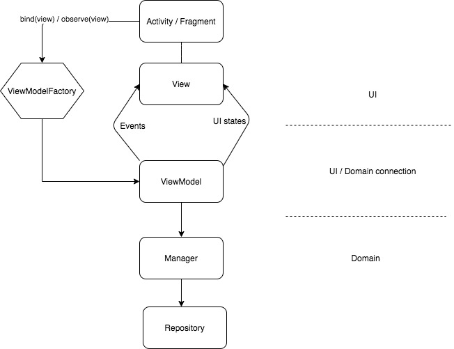

# MvvmRx -> MVI
MVI with RxJava2 -> master branch

## Components
### Activity / Fragment
Activities and fragments will behave as containers of views. The only logic that will reside in such components is the one that is not UI specific, ex: navigation, receiving results, etc.

### View / ViewImpl
It will be responsible for reflecting the emission form the VM (states / events) in the UI.
The View will expose the user interactions with the UI.

### ViewModel
Reactive VM that will connect UI with business domain. This class does not contain neither android UI components nor business logic (tt does not know where the information comes from or goes).

Logic that does not need user input, it should be done upon calling [MainViewModel.execute]. Therefore, every information needed will have to be passed in the constructor.

For logic that needs user interaction, then [MainViewModel.bind] should be used to connect VM with View.

Ideally, it will not contain android packages in order to make it fully testable with unit tests (without robolectric).

### Manager / Use cases / whatever you want to use
This class is optional and it should be used when logic that is not related to fetch / push data is needed, such as process payment, process orders, upload file that will need some validation (the manager will apply the validations and then call the repository to upload the file), etc. The idea is that this class will be reusable, so that you can interact with it from many viewmodels or from a foreground service.

Ideally, it will not contain android packages in order to make it fully testable with unit tests (without robolectric).

### Repository.
This class will provide information coming from different sources (DB / Network). This should provide the information in a way that the consumers do not know anything about where it is coming from. This way, potential changes in the logic will not affect the rest of the components.

This class shoud be used by ViewModels and Managers.
